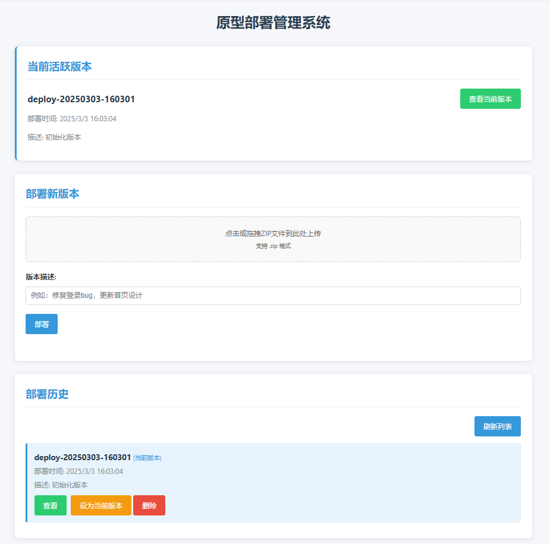

# 原型部署管理系统



一个简单而强大的前端项目部署管理工具，可以轻松上传、管理和访问不同版本的前端项目。

## 功能特点

- 上传前端项目 ZIP 包并自动部署
- 为每次部署创建独立的版本目录
- 查看所有历史部署版本
- 设置当前活跃版本
- 删除不需要的旧版本（密码保护）
- 直接访问任何已部署版本

## 系统要求

- Node.js 12.x 或更高版本
- Nginx 服务器
- 支持符号链接的文件系统

## 安装步骤

1. 克隆或下载本仓库

```bash
git clone https://github.com/gitsifu/frontend-deploy-manager.git
cd frontend-deploy-manager
```

2. 安装依赖

```bash
npm install
```

3. 配置环境变量

修改 `ecosystem.config.js` 中的环境变量

4. 启动应用

开发模式：
```bash
npm run dev
```

生产模式（使用 PM2）：

```bash
pm2 start ecosystem.config.js
```

5. 访问管理界面

打开浏览器访问：`http://localhost:3911`

## 使用说明

### 部署新版本

1. 将前端项目打包为 ZIP 文件
2. 在管理界面上传 ZIP 文件并添加描述
3. 系统会自动解压并部署项目

### 管理版本

- **查看版本**：点击"查看"按钮访问已部署的版本
- **设为当前版本**：点击"设为当前版本"按钮将某个版本设为当前活跃版本
- **删除版本**：点击"删除"按钮并输入管理员密码删除不需要的版本（当前活跃版本不能删除）

## PM2 管理命令

```bash
# 启动应用
pm2 start ecosystem.config.js

# 重启应用
pm2 restart deploy-manager

# 查看日志
pm2 logs deploy-manager

#查看应用状态
pm2 status

#设置开机自启
pm2 startup
pm2 save
```


## 目录结构

```
frontend-deploy-manager/
    ├── server.js # 主服务器文件
    ├── ecosystem.config.js # PM2 配置文件
    ├── package.json # 项目依赖
    ├── .env # 环境变量（开发环境）
    ├── public/ # 静态资源
    │ ├── index.html # 管理界面 HTML
    │ ├── style.css # 样式文件
    │ └── script.js # 前端 JavaScript
    └── README.md # 项目说明
```


## 环境变量说明

| 变量名 | 说明 | 默认值 |
|--------|------|--------|
| PORT | 应用运行端口 | 3911 |
| DEPLOY_BASE_DIR | Nginx 部署根目录 | /www/wwwroot/192.168.1.127_5911 |
| NGINX_HOST | Nginx 服务器 IP 或域名 | 192.168.1.127 |
| NGINX_PORT | Nginx 服务端口 | 5911 |
| DELETE_PASSWORD | 删除版本的密码 | admin123 |
| LOGIN_PASSWORD | 登录密码 | admin123 |

## nginx配置

为避免用户访问当前活跃版本时，由于路径一直一时样的，浏览器缓存问题导致访问的资源不是最新的，请添加如下 `nginx` 相关配置

```nginx.conf
location /current/ {
    # 禁止缓存，强制浏览器每次都向服务器请求最新资源
    add_header Cache-Control "no-store, no-cache, must-revalidate, proxy-revalidate, max-age=0";
    add_header Pragma "no-cache";
    add_header Expires "0";
}
```

## 注意事项

1. 确保 Node.js 进程有权限访问和修改 Nginx 的部署目录
2. 当前版本通过符号链接实现，确保服务器支持符号链接
3. 为安全起见，建议修改默认的删除密码

## 许可证

[MIT License](LICENSE)